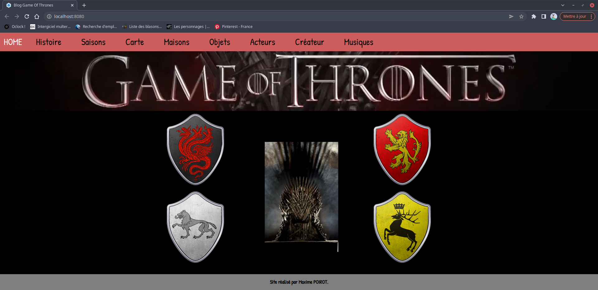

# blog-Game-Of-Throne

Ce site est un blog concérnant l'environnement de la série Game of Throne. Sur l'image ci dessous on peux voir le menu de navigation du menu du blog ainsi qu'une image de fond représentant le trone de fer avec dans chaque coin les 4 emblèmes des 4 plus influentes maisons de la série.

Dans la barre de navigation nous avons l'historique de la série. Voir image ci dessous.

Nous avons un onglet Saison pour repertorier toutes les saisons de la série avec un synopsis pour chaque saison. Voir image ci dessous

Nous avons également un onglet carte pour voir la carte du continent Westeros ainsi que tous les region de la série et voir les informations de chaque région. Voir image ci dessous

Nous avons un onglet Famille qui correspond exactement au même système que la page saison et quand nous avons cliquer sur une famille par exemple famille Arryn nous tombons sur la page de présentation de la famille. Voir image ci dessous.

